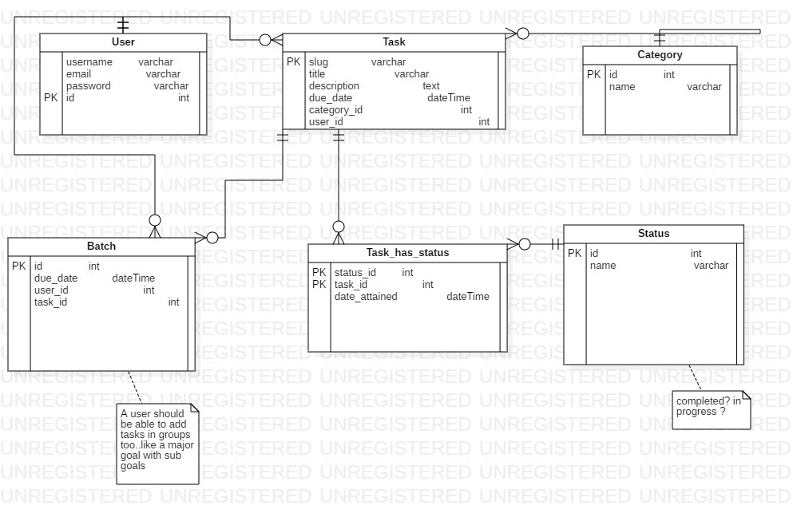

# Project Title

## fury-backend-python Web Application

## Description
The planner micro-service is an enhanced TO-DO micro-service for planning and scheduling tasks.

## User Classes
1. Company administrators
2. Company employees

## Features
* Events can be set up by an administrator
* Employees are authenticated before access is granted
* All employees receive updateson their dashboard
* Auto reminder reminds employees of their events at the following times
  * A month
  * A week
  * 3 days
  * A day
  * An hour
  * 10 minutes
* A notes field is created for employees at the start of each event

## ER Diagram

### Getting Started

These instructions will get you a copy of the project up and running on your local machine for development purpose.

### Prerequisites

    Python 3.6.9
    Pip @Latest

### Installing

You'll need to have a virtual environment installed on your machine

    pip3 install virtualenv
### Go to the directory where the manage.py file is located
Setup virtual environment

    virtualenv -p python3.6 .virtualenv

Activate virtual environment

    source .virtualenv/bin/activate

Install the requirements

    pip install -r requirements

If there are any errors try installing the packages manually:
- Update python to latest \n
- Update pip \n
- pip install django
-pip install django_rest_framework
Debug the rest :-#

    

Make migrations, createsuperuser and run the server

    python manage.py makemigrations
    python manage.py migrate
    python manage.py createsuperuser
    python manage.py runserver

### Built With

    Python - Programming language used
    django-rest-swagger - Used to generate documentation for all the endpoints
### End Points   

-/v1/documentation:
-/v1/account
-/v1/task
